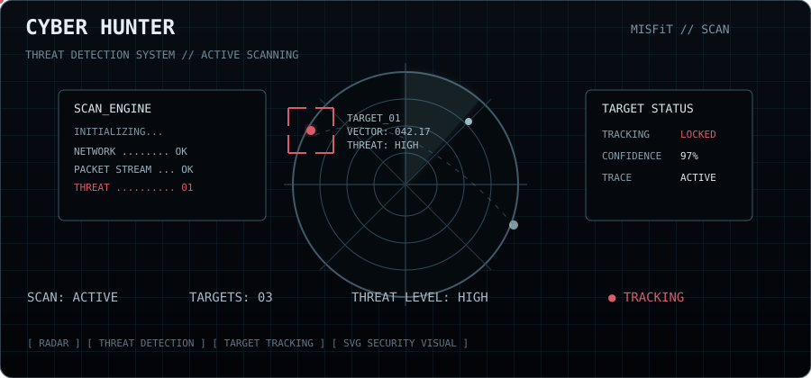

```
█████▄▄▄▄▄   ▄▄▄▄▄    ▄▄▄▄▄     ▄▄▄▄▄     ▄▄▄▄▄▄▄▄▄     ▄▄▄▄▄ ▄▄▄▄▄▄▄▄▄▄▄▄▄▄▄▄▄      ▄▄▄▄▄   ███▄   ▄▄▄▄▄ █████▄▄▄▄▄     ▄▄▄▄▄▄▄▄         
██▓▓▓▓▀▓▓▓▓▄█▓▀▓▓▓▓▄  █▓█▓█  ▄▓▓▓▓▀▓▓▓▓▄  █████ ▀████▄  █▓█▓█ ▐▓█▓█▀▓███▓▀▓▓█▓▌      ▓██▓▓   █▓█▓▌  █▓█▓█ ██▓▓▓▓▀▓▓▓▓▄  ▐████▀▀████▄      
█▓▓▓▓▌ ▐▓▓▓▓█▌ ▐▓▓▓▓▌ ▓▓▓▓▓ ▐▓▓▓▓▌ ▐▓▓▓▓▌ ▓██▓█  ▐▓██▓▌ ▓▓▓▓▓ ▐▓▓▓▌ ▓▓▓▓▓ ▐▓▓▓▌      ▓▓▓▓▓   ▓▓▓▓▓  ▓▓▓▓▓ █▓▓▓▓▌ ▐▓▓▓▓▌ ▓██▓▓  ▐▓▓▓▓▌     
▓▒▓▒▒   ▒▒▓▒▓   ▒▒▓▒▓ ▓▓▓▒▓ ▓▒▓▒▒   ▒▒▓▒▓ ▓▓█▓▓   ▒▓▓▒▒ ▓▓▓▒▓ ▀     ▒▓▒▓▓     ▀      ▒▓▓▒▒   ▓▓▓▒▓  ▓▓▓▒▓ ▓▒▓▒▒   ▒▒▓▒▓ ▒▓▓▓▓   ▓▒▓▓▒     
▒▒▒▒▒   ▒▒▒▒▒   ▒▒▒▒▒ ▓▒▓▓▒ ▓▒▓▓▒▄        ▒▒▓▒▒   ░░░▒░ ▓▒▓▓▒       ▒▒▒▒▓            ▒▒▒▒▒  ▐▓▒▓▒▀  ▓▒▓▓▒ ▒▒▒▒▒   ▒▒▒▒▒ ▒▒▓▒▌             
░░▒░▒   ▒░▒░░   ▒░▒░░ ░▒░▓▒ ▀▀▀▓▒▓▒░▒▒▀▄  ▒▓▒▓▒▓▒       ░▒░▓▒       ▒░▒▓▒            ▒░░▒░▒▓▓▒▓░    ░▒░▓▒ ░░▒░▒   ▒░▒░░ ▒░▒▒▄▄░▓▒░▒█▀     
░░░░░   ░░░░░   ░░░░░ ░░░░░        ▀░▒░▒▒ ░░░▒░         ░░░░░       ░░░░░            ░░░░░  ▀▒░░░   ░░░░░ ░░░░░   ░░░░░ ░░░░▌ ▀▀░░░░▌     
░░▀░░   ░░▀░░   ░░▀░░ ▀░▀░░ ░░▀░░   ▀░░░▄ ▀░▀░░         ▀░▀░░       ░░░▀░            ░░▀░█   ░▀░█░  ▀░▀░░ ░░▀░░   ░░▀░░ ░░▀░▀   ▐░▀░░     
▀  ▀▐   ▓▀  ▀   ▓▀  ▀  ▀  ▀  ▀  ▀   ▒▀ ▀░    ▀           ▀  ▀       ▀ ▀              ▀▀▀ ▀     ▀ ▀   ▀  ▀ ▀  ▀▐   ▓▀  ▀  ▀       ▀▀ ▀     
▓ ▄▓▄   ▄▓▄ ▓   ▄▓▄ ▓ ▓▄ ▓▄ ▓▄ ▓▄   ▓▄▄▓▓  ▓▄ ▄         ▓▄ ▓▄       █ ▄▓             ▓ ▄ ▓   ▓▄▄ ▓▄ ▓▄ ▓▄ ▓ ▄▓▄   ▄▓▄ ▓ ▓▄ ▄▓   ▌▓▄ ▓     
░▒▒▓▒   ▀▓▒▒▀   ▒▓▒▒░ ▄▒▓▒▄ ▄▒▓▒▄  ▄▄▒▒▒▒ ▒▒▒▓▒         ▄▒▓▒▄       ▓▓▓▒▒            ▒▒▒▄▒   ▄▓▒ ▒▀ ▄▒▓▒▄ ░▒▒▓▒   ▒▓▒▒░ ▒▒▒▒▄   ▒▓▒▒░     
░░░░░           ░░░░░ ░░░░░ ▀▄░░░░░░░░░▄▀ ░░░▒░         ░░░░░      ▄▒▒▒░░▄           ░░░░░   ▒▒▒▒▒▒ ░░░░░ ░░░░░   ░░░░░ ▀▀▄░░▓▄▀░░░░█
```

<p align="center">
  
</p>


<p align="center">

  

  

  

</p>


<p align="center">

<a href="https://github.com/MiSFiT-SeCuRiTY">

</a>

<a href="https://x.com/MiSFiT_KiNG0">

</a>

<a href="https://profile.hackthebox.com/profile/01a07865-85e0-727b-b34c-f942312cd56e">

</a>

<a href="https://tryhackme.com/p/rudramalla999">

</a>

<a href="https://www.youtube.com/@MiSFiT_SeCuRiTY">

</a>

<a href="https://www.instagram.com/misfitsecurity/">

</a>

</p>

## 🧠 About Me

```text
┌──[ MiSFiT-SeCuRiTY ]──[~/about]
│
├─▸ Cybersecurity enthusiast focused on offensive security,
│   security research, and real-world attack & defense concepts.
│
├─▸ Building cybersecurity tools, automation utilities,
│   and security-focused applications.
│
├─▸ Exploring penetration testing, vulnerability research,
│   network security, OSINT, and adversary techniques.
│
├─▸ Passionate about Python, Linux, system internals,
│   and developing practical security tooling.
│
├─▸ Active on Hack The Box & TryHackMe, continuously
│   sharpening practical security skills.
│
└─▸ Mission: Learn → Build → Break → Secure
```

> **"Curiosity drives the research. Building turns knowledge into capability."**


## 🧠 Philosophy

I believe that the best way to understand technology is to **question it, break it, and rebuild it**.

I don't chase shortcuts. I prefer to understand how things work beneath the surface, experiment with ideas, and turn curiosity into something useful.

For me, cybersecurity is not just about finding vulnerabilities — it's about **thinking differently, learning continuously, and building with purpose**.

> *“The deeper you understand the system, the harder it becomes to surprise you.”*
